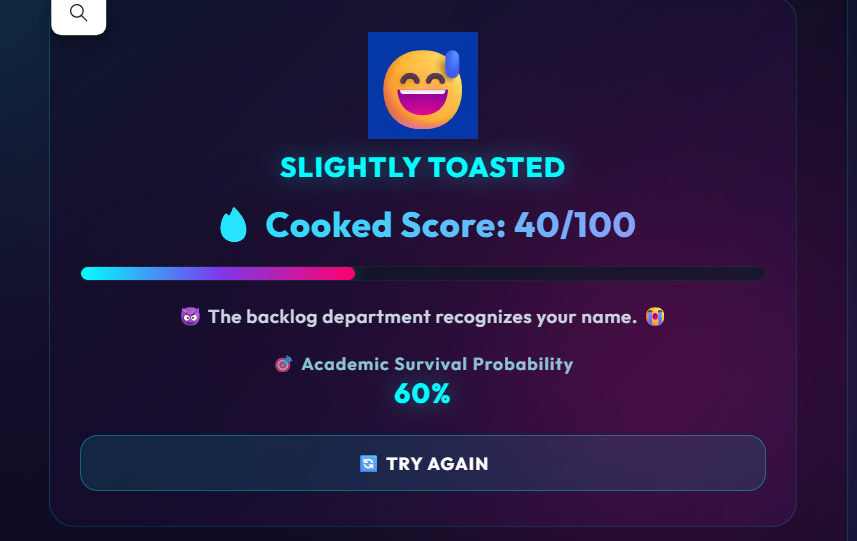

# AM I COOKED? 🎯

## Basic Details
### Team Name: Team Tech

### Team Members
- Team Lead: Adarsana Binu - College of Engineering Attingal
- Member 2: Ajas - College of Engineering Attingal

### Project Description
"AM I COOKED?" is a humorous, AI-powered student life diagnostic system. By taking your lifestyle and academic metrics—such as sleep hours, pending assignments, exam countdown, attendance percentage, backlogs, screen time, and caffeine intake—it calculates how cooked you really are using a Machine Learning model.

### The Problem (that doesn't exist)
Students often wonder how badly their academic life is going, especially when exams, assignments, low attendance, backlogs, lack of sleep, and excessive screen time start piling up into an existential crisis.

### The Solution (that nobody asked for)
An AI-driven diagnostic system that analyzes your questionable life choices, predicts your "Cooked Score" (out of 100) and Academic Survival Probability using a Machine Learning model, and delivers brutal, custom trash talk tailored to your exact academic disaster.

---

## Technical Details

### Technologies/Components Used

For Software:
- **Languages:** Python, JavaScript (ES6+), HTML5, CSS3
- **Frameworks:** Flask
- **Libraries:** Scikit-learn, Pandas, Joblib, Flask-CORS
- **Tools:** VS Code, Git, GitHub, Render

For Hardware:
- Laptop / PC
- Minimum 4 GB RAM
- Keyboard and mouse
- Internet connection (for setup and deployment)

---

### Implementation

For Software:
The user inputs key academic and lifestyle metrics into the web interface. The frontend JavaScript collects and packages this data, then sends it via JSON to the Flask backend. 

A trained Random Forest Regression model (`cooked_model.pkl`) processes the inputs (including normalized caffeine intake) to output a continuous Cooked Score from 0 to 100. Based on the score and specific inputs, the backend assigns a "Cooked Level", survival rate, and personalized trash talk, returning it to the frontend for interactive display.

#### Machine Learning Model
- **Model Type:** Random Forest Regressor
- **Trained Model File:** `cooked_model.pkl`
- **Features Used:**
  - Sleep Hours
  - Pending Assignments
  - Days Until Exam
  - Attendance Percentage
  - Backlogs
  - Phone Screen Time
  - Coffee / Caffeine Intake (mg)

#### Output Metrics:
- **Cooked Score:** 0 – 100
- **Academic Survival Probability:** 0% – 100%
- **Cooked Level:** NOT COOKED 😎, SLIGHTLY TOASTED 😅, GETTING COOKED 😰, DEEP FRIED 🔥, ABSOLUTELY COOKED 💀
- **Personalized Trash Talk:** Contextual roast based on student habits

---

# Installation
```bash
pip install -r requirements.txt
```

# Run
```bash
python app.py
```

---

### Project Documentation
For Software:

# Screenshots (Add at least 3)

*Input interface where students enter their academic and lifestyle metrics.*


*Diagnosis output screen showing the Cooked Score, Academic Survival Probability, and Cooked Level.*


*Machine learning model prediction and personalized humorous trash talk.*

---

### Project Demo
# Live Link
🚀 **Live App:** [AM I COOKED? 🔥](https://useless-project-rm33.onrender.com/)


# Additional Demos
- Web application hosted live on Render: [https://useless-project-rm33.onrender.com/](https://useless-project-rm33.onrender.com/)

---

## Team Contributions
- **Adarsana Binu:** Frontend UI/UX design, responsive layouts, dynamic animations, and JavaScript API integration.
- **Ajas:** Machine Learning model training, Flask backend API design, and Render cloud deployment.

---
Made with ❤️ at TinkerHub Useless Projects 


